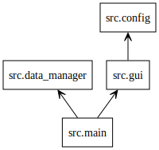
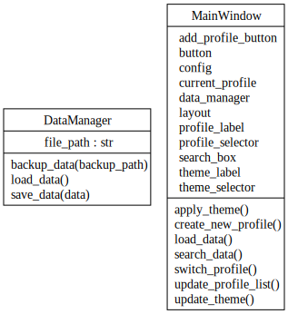
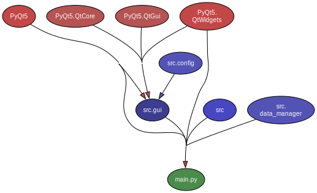

# 📊 Interactive Data App Architecture

## 🏗️ Overview

This document outlines the architecture of the **Interactive Data App**, including diagrams to visualize class relationships, module dependencies, and actual import flows. These diagrams are auto-generated to reflect the current code structure.

_Last updated: {{DATE}}_

---

## 📦 Package & Module Relationships

**Diagram:** `packages_InteractiveDataApp.dot`  
**Description:** Visualizes how Python modules and packages are interconnected within the app.

### 🔍 View:
- **In VS Code**: Open with **Graphviz Interactive Preview**.
- **Convert to PNG/SVG** (optional):

### Module Dependency Diagram


```bash
dot -Tpng diagrams/packages_InteractiveDataApp.dot -o diagrams/packages_InteractiveDataApp.png
```

### 🌐 Example Use Cases:
- Understanding the **module-level structure**.
- Preparing for **modular refactoring**.

---

## 🧱 Class Relationships

**Diagram:** `classes_InteractiveDataApp.dot`  
**Description:** Shows classes, methods, and relationships in a UML-style graph.

### 🔍 View:
- **In VS Code**: Open with **Graphviz Interactive Preview**.
- **Convert to SVG**:

### Class Diagram


```bash
dot -Tsvg diagrams/classes_InteractiveDataApp.dot -o diagrams/classes_InteractiveDataApp.svg
```

### 🌐 Example Use Cases:
- Visualizing **class responsibilities and interactions**.
- Guiding **object-oriented design** and **new feature integration**.

---

## 🔄 Module Dependency Graph

**Diagram:** `module_dependencies.svg`  
**Description:** Displays real-world imports and module dependencies as analyzed by Pydeps.

### 🔍 View:
- **Directly in Browser or VS Code** (SVG format).

### Module Dependency Diagram


### 🌐 Example Use Cases:
- Identifying **tight coupling** and **circular dependencies**.
- Planning **codebase restructuring**.

---

## ⚙️ How to Update These Diagrams

### 1. **Class and Package Diagrams** (Pyreverse)
```bash
pyreverse -o dot -p InteractiveDataApp src/main.py src/gui.py src/config.py src/data_manager.py
```

### 2. **Module Dependency Graph** (Pydeps)
```bash
pydeps src/main.py --max-bacon=2 --noshow -T svg -o diagrams/module_deps.svg
```

> **Note:** Ensure **Graphviz** and **Pydeps** are installed and available in system PATH.

---

## 📁 File Locations

| File                                 | Purpose                                 | Location       |
|--------------------------------------|-----------------------------------------|----------------|
| `classes_InteractiveDataApp.dot`     | Class diagram (UML-like)                | `/diagrams/`   |
| `packages_InteractiveDataApp.dot`    | Package/module relationship diagram    | `/diagrams/`   |
| `module_deps.svg`                   | Real import/call dependency graph      | `/diagrams/`   |

---

## 🚀 Next Steps

- Review diagrams when starting **new features** or **refactoring**.
- Keep diagrams **up-to-date** as part of development workflow.
- Include diagrams in **internal documentation and onboarding guides**.

